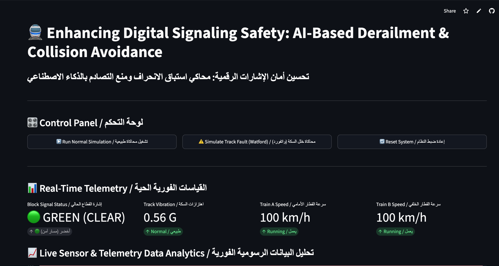

<h1 align="center">🚆 Rail AI Safety Simulator</h1>
<h3 align="center">Enhancing Digital Signaling Safety: AI-Based Derailment & Collision Avoidance</h3>
<h3 align="center" dir="rtl">تحسين أمان الإشارات الرقمية: محاكي استباق الانحراف ومنع التصادم بالذكاء الاصطناعي</h3>

  
  
  

<h2>📸 Live Demo</h2>

  

  🔗 <a href="https://mun9uk-ship-it-rail-ai-safety-simulator-v01-yj0ycc.streamlit.app/"><b>Launch the live simulator in your browser</b></a>

<h2>📖 Project Overview</h2>

This project is an AI-powered simulation built to explore digital railway
signaling and safety. It analyses simulated real-time sensor telemetry
(track vibration) using an <b>Isolation Forest anomaly detection model</b>
to flag potential derailment events or track faults.

When a critical anomaly is flagged, the app calculates emergency braking
physics — reaction time, required stopping distance, and deceleration —
and automatically triggers a fail-safe braking action to stop the trailing
train and prevent a collision.

<h2 dir="rtl">📖 نبذة عن المشروع</h2>

هذا المشروع عبارة عن محاكاة مدعومة بالذكاء الاصطناعي لاستكشاف أمان
الإشارات الرقمية في السكك الحديدية. يحلل بيانات اهتزاز افتراضية للمسار
باستخدام <b>نموذج Isolation Forest لكشف الشذوذ</b> للتنبؤ بحالات
انحراف محتملة أو أعطال في المسار.

عند رصد خطر حرج، يحسب النظام فوراً معادلات الكبح الطارئ — زمن
الاستجابة، مسافة التوقف اللازمة، ومعدل التباطؤ — ويفعّل تلقائياً
إجراء فرملة آمن لإيقاف القطار الخلفي ومنع التصادم.

<h2>⚙️ Core Features</h2>

<ul>
  <li><b>AI Anomaly Detection:</b> Isolation Forest model trained to spot abnormal track vibration readings</li>
  <li><b>Physics-Based Braking Calculations:</b> Real-time deceleration, braking distance, and total stopping time</li>
  <li><b>Bilingual Dashboard:</b> Full English and Arabic labels throughout the UI</li>
  <li><b>Live Interactive Telemetry:</b> Real-time line charts of vibration and train speed</li>
</ul>

<h2>🛠️ Installation & Requirements</h2>

Requires <b>Python 3.9+</b>.

<pre><code>git clone https://github.com/mun9uk-ship-it/rail-ai-safety-simulator.git
cd rail-ai-safety-simulator
pip install streamlit pandas numpy scikit-learn
</code></pre>

<h2>🚀 How to Run</h2>

<pre><code>streamlit run v01.py
</code></pre>

This opens the simulator locally at <code>http://localhost:8501</code>.

Or skip setup entirely and try the
<a href="https://mun9uk-ship-it-rail-ai-safety-simulator-v01-yj0ycc.streamlit.app/">hosted version</a>.

<h2>💡 How to Use</h2>

<ol>
  <li>Click <b>▶️ Run Normal Simulation</b> to watch both trains operate safely under standard conditions</li>
  <li>Click <b>⚠️ Simulate Track Fault (Watford)</b> to introduce a high-vibration anomaly and watch the AI detect it and trigger automatic emergency braking</li>
  <li>Click <b>🔄 Reset System</b> to clear the run and return to default positions</li>
</ol>

<h2>🧠 How I built this</h2>

I have hands-on experience with rail ticketing, revenue protection, and
an OPC train-driver aptitude certification, and I'm currently applying my
AI/ML coursework (IBM AI Fundamentals, Machine Learning with Python) to
transport-safety style problems. I used an AI coding assistant to help
write and structure this app, and worked through the logic — the
Isolation Forest model, the object-oriented <code>Train</code> class, and the
braking-physics calculations — to make sure I understand exactly how and
why it works.

<h2 dir="rtl">🧠 كيف بنيت هذا المشروع</h2>

لدي خبرة عملية في تذاكر السكك الحديدية وحماية الإيرادات، وشهادة اجتياز
اختبار OPC لسائق قطار، وأطبّق حالياً ما تعلمته في دورات الذكاء
الاصطناعي (IBM AI Fundamentals، تعلم الآلة ببايثون) على مسائل تشبه
أمان النقل. استخدمت مساعد ذكاء اصطناعي في كتابة وهيكلة هذا التطبيق،
وراجعت المنطق بالكامل — نموذج Isolation Forest، وكلاس <code>Train</code>،
وحسابات فيزياء الكبح — للتأكد أنني أفهم تماماً كيف ولماذا يعمل.

<h2>⚠️ Limitations</h2>

<ul>
  <li>All telemetry (track vibration) is <b>simulated</b>, not real sensor data</li>
  <li>This is a learning/portfolio project, not a certified or validated safety system</li>
  <li>A real deployment would require real sensor integration, domain-expert validation, and formal safety-case testing</li>
</ul>
